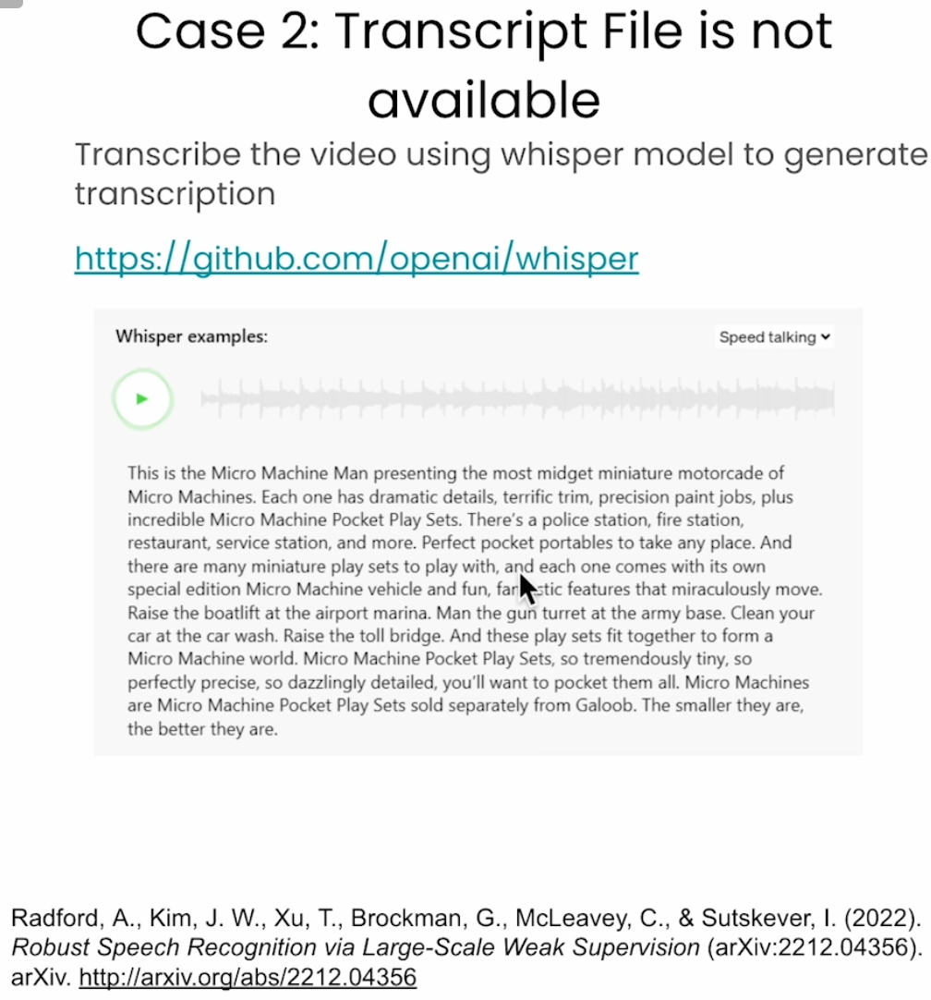

# Multimodal Rag - Chat with Videos
Python 3.11.9

## Multimodal Embeddings

使用Bridge Tower作为多模态嵌入模型，为图片-文本对生成一个联合嵌入

## Preprocessing Videos for Multimodal RAG

 

  

## Multimodal Retrieval from Vector Stores

## Large Vision Language Modles (lvlms)

llava之所以受欢迎，是因为他可以搭载不同的语言模型

## Multimodal Rag with Multimodal Langchain

